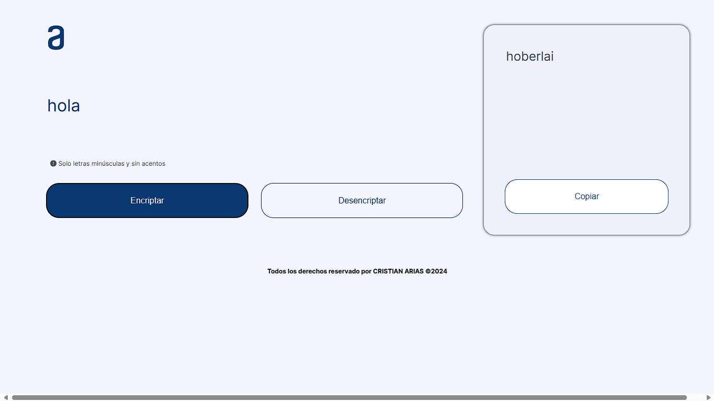
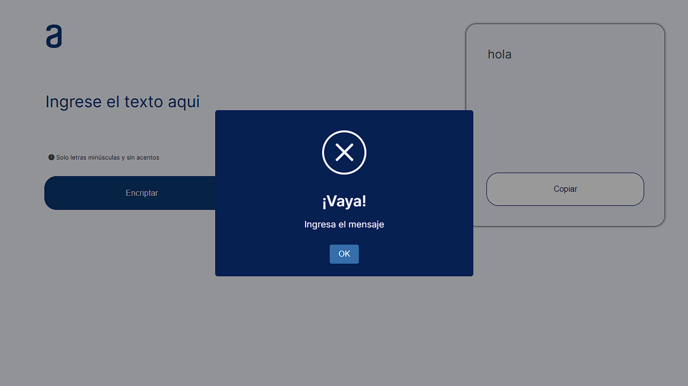
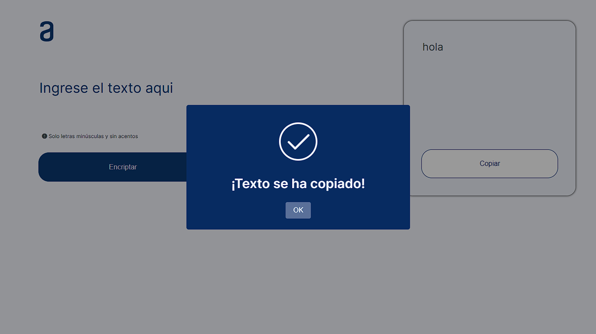

# Encriptador de Texto

Este proyecto es una aplicación web de encriptador de texto desarrollada como parte del Challenge Aulara Oracle Next Education. La aplicación permite encriptar y desencriptar textos utilizando un conjunto de reglas específicas, y cuenta con una interfaz de usuario amigable.

## Características

- Encriptar texto según reglas específicas.
- Desencriptar texto encriptado.
- Copiar el texto encriptado o desencriptado al portapapeles.
- Limpiar el área de texto de entrada con un solo clic.

## Tecnologías Utilizadas

- HTML5
- CSS3
- JavaScript
- FontAwesome
- SweetAlert2

## Estructura del Proyecto

```bash
encriptador-de-texto/
├── public/
│ ├── img/
│ │ └── muneco.svg
│ ├── Logo.svg
├── css/
│ └── style.css
├── js/
│ └── app.js
├── index.html
└── README.md
```

## Instalación

1. Clona el repositorio:
```bash
    git clone https://github.com/tu-usuario/encriptador-de-texto.git
```

2. Navega al directorio del proyecto:
```bash
    cd encriptador-de-texto
```

## Uso
1. Abre el archivo index.html en tu navegador web preferido.
1. Ingresa el texto que deseas encriptar en el área de texto.
1. Haz clic en el botón ```"Encriptar"``` para encriptar el texto.
1. Haz clic en el botón ```"Desencriptar"``` para desencriptar el texto encriptado.
1. Haz clic en el botón ```"Copiar"``` para copiar el texto encriptado o desencriptado al portapapeles.
1. Haz clic en el icono de borrar para limpiar el área de texto.

## Funcionalidades
### Encriptar
Convierte el texto ingresado en un texto encriptado según las siguientes reglas:
* a -> ai
* e -> enter
* i -> imes
* o -> ober
* u -> ufat

### Desencriptar
Convierte el texto encriptado de vuelta a su forma original aplicando las reglas inversas.

### Copiar
Copia el texto encriptado o desencriptado al portapapeles utilizando la API de portapapeles de JavaScript.

## Capturas de Pantalla
<p align="center">
    
    
    
</p>

## Créditos
Desarrollado por *Cristian Arias* como parte del Challenge Aulara Oracle Next Education.

## Licencia
Este proyecto está licenciado bajo la Licencia MIT. Consulta el archivo [LICENSE](/LICENSE) para más detalles.